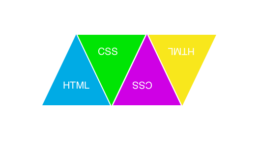

# CSS

## Releases1:

- Create an Image Thumbnail. So that whenever you hover the image it grows big(height & width) for 2s
- Create 6 images of a car one below another(on the left most of the webpage). Each car should move
10 units forward to it's initial position. Apply 6 Speed Curve transitions to all those car images respectively as mentioned below.

```
ease - specifies a transition effect with a slow start, then fast, then end slowly (this is default)
linear - specifies a transition effect with the same speed from start to end
ease-in - specifies a transition effect with a slow start
ease-out - specifies a transition effect with a slow end
ease-in-out - specifies a transition effect with a slow start and end
cubic-bezier(n,n,n,n) - lets you define your own values in a cubic-bezier function
```

HINT: Use CSS Keyframes

- Create a loading bar(with an image) that transforms and keeps on rotation when hover it or click it


## Release 2:
- Create the below picture using pure html & css knowledge


## Release 3:
- Go Explore HTML 5 Canvas. Write a HTMLCanvas.md for this release. This .md file should contain your understanding of HTML5 canvas concepts and push to Github along with your rest of work(core block and stretch block)

## Release 4:
- Create a drop-down with complexity of that of a Flipkart(a complete hirarchy of appliances & product with sub-categories) in pure HTML/CSS without using any front-end library
